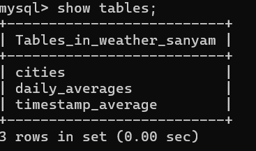
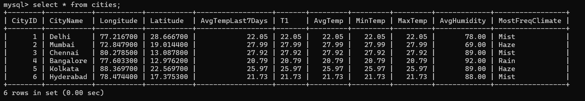
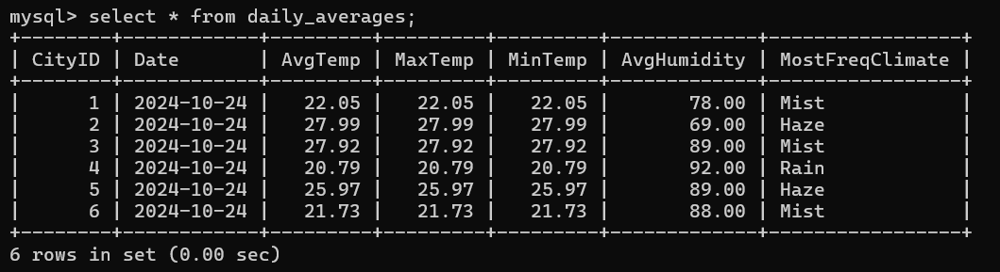
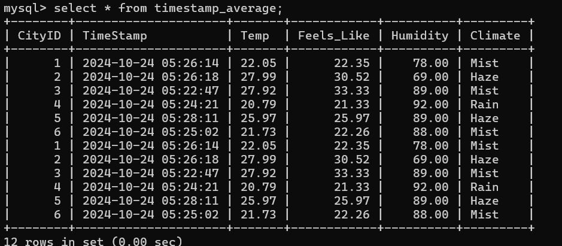

# Real-Time-Data-Processing-System-for-Weather-Monitoring-with-Rollups-and-Aggregates

## Files and Directories

- **add_cities.py**: Script to add new cities to the monitoring system.
- **config.py**: Configuration file for the project settings.
- **database_creation.py**: Script to create and initialize the database.
- **main.py**: Main script to run the weather monitoring system.
- **plots/**: Directory containing subdirectories for different cities, each storing weather data plots.
  - **Bangalore/**: Weather data plots for Bangalore.
  - **Chennai/**: Weather data plots for Chennai.
  - **Delhi/**: Weather data plots for Delhi.
  - **History/**: Historical weather data plots.
  - **Hyderabad/**: Weather data plots for Hyderabad.
  - **Kolkata/**: Weather data plots for Kolkata.
  - **Mumbai/**: Weather data plots for Mumbai.
- **README.md**: This file.

## Getting Started

### Prerequisites
- Python 3.x
- MySql installed

### Installation
1. Clone the repository:
    ```sh
    git clone https://github.com/SanyamGarg12/Real-Time-Data-Processing-System-for-Weather-Monitoring-with-Rollups-and-Aggregates
    cd Real-Time-Data-Processing-System-for-Weather-Monitoring-with-Rollups-and-Aggregates
    ```

2. Install the required packages:
    ```sh
    pip install -r requirements.txt
    ```

### Create Database and Configure project:
1. Log in to MySQL as the root user (or another user with sufficient privileges):

   ```bash
   mysql -u root -p
   ```
2. Once logged in, create a new database using the following command:

    ```bash
    CREATE DATABASE my_database_name;
    ```
3. Verify database creation:

    ```bash
    SHOW DATABASES;
    ```
4. Create a new user with a specific password using the following command:

    ```bash
    CREATE USER 'my_username'@'localhost' IDENTIFIED BY 'my_password';
    ```
5. To grant all privileges on the newly created database to the new user, use:

    ```bash
    GRANT ALL PRIVILEGES ON my_database_name.* TO 'my_username'@'localhost';
    ```

6. Navigate to [config.py](config.py) file and update your credentials there accordingly.

### Usage
1. Initialize the database:
    ```sh
    python database_creation.py
    ```

2. Add cities to the monitoring system:
    ```sh
    python add_cities.py
    ```

3. Start the weather monitoring system:
    ```sh
    python main.py
    ```

## Functions

### Main Functions in `main.py`

- **[`get_weather_data`](main.py)**: Fetches weather data for a given city.
- **[`plot_climate_distribution`](main.py)**: Plots the climate distribution for all cities.
- **[`plot_temperature_distribution`](main.py)**: Plots the temperature distribution for all cities.
- **[`plot_average_temp_humidity`](main.py)**: Plots the average temperature and humidity by city.
- **[`daychange`](main.py)**: Handles daily data processing and plotting.
- **[`new_interval`](main.py)**: Fetches new weather data at regular intervals and updates the database.
- **[`interpret`](main.py)**: Interprets the weather data and generates alerts.
- **[`plot_daily_weather`](main.py)**: Plots daily weather data for each city.
- **[`process_weather_data`](main.py)**: Processes raw weather data into a structured format.

## Working
- main.py will run in an infinite loop fetching data from api and updating database and generating graphs as per description of plots folder.
- To test [`daychange`](main.py) function, uncomment a code snippet as instructed in main.py.
- Plots will be generated as the day changes.

## User Preferences
- In [main.py](main.py) from line 27-30, multiple thresholds are defined which can be altered as per users preference.
- [`convert_temperature`](main.py) is defined for different units of temperature. By default temperature is in °C.

## Database Description:
- **There are three tables**
    
    
- **Cities table**
    - After executing main.py, it will look something like this:
    - **Primary Key**: `city_id`
    - **Columns**: `city_id`, `city_name`, `latitude`, `longitude`

    

- **daily_averages table**
    - **Primary Key**: `city_id`, `date`
    - **Foreign Key**: `city_id` (references `Cities.city_id`)
    - **Columns**: `date`, `city_id`, `average_temperature`, `average_humidity`

    

- **timestamp_average table**
    - **Primary Key**: `city_id`, `timestamp`
    - **Foreign Key**: `city_id` (references `Cities.city_id`)
    - **Columns**: `timestamp`, `city_id`, `temperature`, `humidity`

    

## License
This project is licensed under the MIT License. See the LICENSE file for details.

## Contact
For any inquiries, please contact [sanyam22448@iiitd.ac.in].